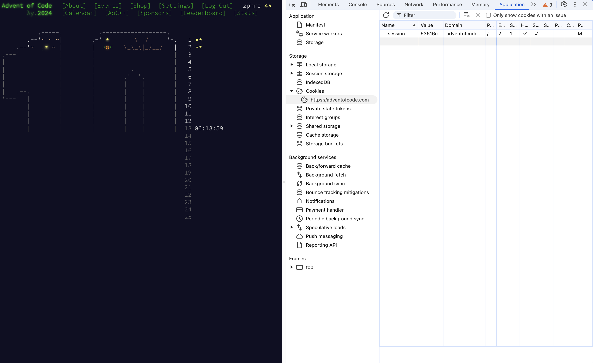

# Template Use

## Requirements

See [requirements.md](./requirements.md).

### TLDR

```sh
cargo install aoc-cli cargo-generate
```

## Usage

### `init.sh`
Run ./init.sh to automatically install and configure your environment. Make sure to have your cookie from Advent of Code ready to paste. You can get your cookie through chrome's developer console as shown here: 

### `./day`
Run `./day X` to automatically generate a template for day `X`.

#### Example
```sh
./day 1 # initializes a rust project for the first day of advent of code
```